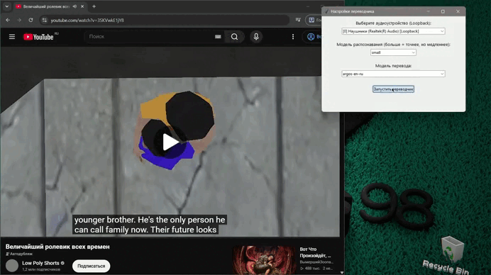

# 🎧VOICE_COCKS Переводчик Discord / YouTube (EN -> RU) в реальном времени

```markdown
# 🎙️ Discord Translator

**Переводчик речи в реальном времени** для Discord, YouTube и любых других приложений.
Захватывает системный звук, распознаёт английскую речь и выводит перевод на русский
в виде субтитров поверх всех окон.

---

## ✨ Возможности

- 🎧 **Захват системного звука** через WASAPI Loopback (работает с любым приложением)
- 🗣️ **Распознавание речи** на базе `faster-whisper` (модели `tiny` / `base` / `small` / `medium`)
- 🌐 **Мгновенный перевод** с английского на русский через `ctranslate2`
- 🖥️ **Прозрачный оверлей** с субтитрами поверх всех окон, включая игры
- ⚙️ **Окно настроек** — выбор аудиоустройства и модели распознавания
- 🔘 **Кнопка переключения** субтитров прямо в оверлее
- 📜 **Длинный текст** — оригинал и перевод с переносом и прокруткой
- 🚀 **Гибридная архитектура** — стабильный Python-бэкенд + красивый Electron-интерфейс

---

## 🏗️ Архитектура

```
┌─────────────────────────────┐        WebSocket (:8765)        ┌──────────────────────────────┐
│  Electron (оверлей + настройки) │ ◄────────────────────────────► │  Python (бэкенд)              │
│  • Субтитры поверх окон       │                                │  • Захват звука (WASAPI)      │
│  • Выбор устройства и модели  │        HTTP (:8766)            │  • Распознавание (Whisper)    │
│  • Кнопка ВКЛ/ВЫКЛ           │ ◄────────────────────────────► │  • Перевод (CTranslate2)      │
└─────────────────────────────┘                                │  • Настройки (конфиг)         │
                                                                 └──────────────────────────────┘
```

### Технологический стек

| Компонент | Технология |
|---|---|
| Захват звука | `PyAudioWPatch` (WASAPI Loopback) |
| Распознавание речи | `faster-whisper` (CTranslate2) |
| Перевод | `ctranslate2` + `Helsinki-NLP/opus-mt-en-ru` |
| Сегментация речи | `webrtcvad-wheels` |
| Связь | `websockets` (WebSocket) + `http.server` |
| Оверлей | `Electron` (Chromium) |

---

## 📋 Требования

### Обязательные

- **ОС:** Windows 10/11
- **Python:** 3.12.x ([скачать](https://www.python.org/downloads/release/python-3120/))
  - ⚠️ При установке **обязательно** поставьте галочку *"Add Python to PATH"*
- **Node.js:** LTS-версия ([скачать](https://nodejs.org/))
- **Git** ([скачать](https://git-scm.com/))

### Желательные

- **Микрофон/наушники** для проверки захвата звука
- **Стабильный интернет** для первой загрузки моделей (~300 МБ)

---

## 🚀 Установка

### 1. Клонируйте репозиторий

```bash
git clone https://github.com/ВАШ_НИК/discord-translator.git
cd discord-translator
```

### 2. Создайте виртуальное окружение и установите зависимости

```bash
python -m venv venv
venv\Scripts\activate
pip install -r requirements.txt
```

### 3. Установите зависимости Electron

```bash
cd overlay
npm install
cd ..
```

> ⚠️ Если Electron не устанавливается (ошибка `Electron failed to install correctly`), выполните:
> ```bash
> cd overlay\node_modules\electron
> node install.js
> cd ..\..
> ```

### 4. Первый запуск

```bash
.\start.bat
```

При первом запуске автоматически скачаются:
- Модель распознавания `faster-whisper tiny` (~40 МБ)
- Модель перевода `Helsinki-NLP/opus-mt-en-ru` (~300 МБ)

Это может занять **3–5 минут** в зависимости от скорости интернета.

---

## 📁 Структура проекта

```
discord-translator/
├── server.py                 # WebSocket-сервер (основной бэкенд)
├── config_server.py          # HTTP-сервер настроек (:8766)
├── audio_capture.py          # Захват звука через WASAPI
├── vad.py                    # Детектор речи (VAD)
├── asr.py                    # Распознавание речи (faster-whisper)
├── translator.py             # Перевод EN→RU (ctranslate2)
├── requirements.txt          # Python-зависимости
├── settings.json             # Сохранённые настройки
├── start.bat                 # Запуск одним кликом
│
├── models/                   # Модели (скачиваются автоматически)
│   └── opus-mt-en-ru/
│       ├── model.bin
│       ├── config.json
│       └── shared_vocabulary.json
│
└── overlay/                  # Electron-приложение
    ├── package.json
    ├── main.js               # Главный процесс
    ├── preload.js            # Безопасный мост между процессами
    ├── index.html            # Оверлей субтитров
    ├── renderer.js           # Логика оверлея
    ├── settings.html         # Окно настроек
    └── settings.js           # Логика настроек
```

---

## 🎮 Использование

### Быстрый старт

1. Запустите `start.bat`
2. Дождитесь появления окна **⚙ Настройки**
3. Выберите устройство вывода и модель распознавания
4. Нажмите **«Применить и запустить»**
5. Внизу экрана появится прозрачный оверлей с субтитрами

### Управление в оверлее

| Элемент | Действие |
|---|---|
| **Субтитры: ВКЛ** | Переключить показ субтитров |
| **⚙** | Открыть окно настроек (перезапуск с новыми параметрами) |
| **Колёсико мыши** | Прокрутка длинного текста |
| **Наведение** | Кнопки становятся непрозрачными |

### Режимы работы

- **Субтитры ВКЛ** — внизу экрана отображается оригинал (серый) и перевод (белый)
- **Субтитры ВЫКЛ** — оверлей скрывается, но звук продолжает обрабатываться
- **Переподключение** — если бэкенд упал, оверлей автоматически переподключается

---

## ⚙️ Настройки

### Выбор устройства

Приложение захватывает звук **устройств вывода** (наушники, колонки) через механизм
WASAPI Loopback. Это значит, что переводится **всё, что играет на компьютере**:
- Голос в Discord
- Видео на YouTube
- Подкасты, стримы, игры

### Выбор модели распознавания

| Модель | Размер | Скорость | Точность |
|---|---|---|---|
| `tiny` | ~40 МБ | ⚡ Очень быстро | ⭐⭐ |
| `base` | ~75 МБ | ⚡ Быстро | ⭐⭐⭐ |
| `small` | ~250 МБ | 🐢 Средне | ⭐⭐⭐⭐ |
| `medium` | ~770 МБ | 🐌 Медленно | ⭐⭐⭐⭐⭐ |

> 💡 Для игр и Discord рекомендуется `tiny` или `base`.
> Для лекций и подкастов — `small` или `medium`.

---

## 🔧 Ручной запуск (без `start.bat`)

Если хотите запустить компоненты по отдельности:

**Терминал 1 — сервер настроек:**
```bash
venv\Scripts\python.exe config_server.py
```

**Терминал 2 — основной бэкенд:**
```bash
venv\Scripts\python.exe server.py --device 0 --model tiny
```

**Терминал 3 — оверлей:**
```bash
cd overlay
npx electron .
```

---

## 🐛 Решение проблем

### «Устройства не найдены»

Убедитесь, что на компьютере есть работающие устройства вывода.
Проверьте в **Параметры → Звук → Вывод**.

### «Модель перевода не найдена»

Удалите папку `models/opus-mt-en-ru` и перезапустите приложение —
модель скачается заново.

### «Ошибка загрузки Electron»

```bash
cd overlay\node_modules\electron
node install.js
```

### «Перевод обрывается на длинных фразах»

Увеличьте параметр `max_utterance_ms` в файле `server.py`:
```python
segmenter = Segmenter(aggressiveness=2, silence_ms=1000, max_utterance_ms=15000)
```

### «Оверлей не появляется поверх полноэкранной игры»

Убедитесь, что игра запущена в режиме **«Окно без рамки»** (Borderless), а не
«Эксклюзивный полный экран». В эксклюзивном режиме ни одно приложение не может
рисовать поверх игры.

### «Низкая скорость перевода»

Используйте модель `tiny` или `base`. Модели `small` и `medium` требуют больше
вычислительных ресурсов и могут задерживать вывод.

---

## 📊 Системные требования

| Компонент | Минимум | Рекомендуется |
|---|---|---|
| **ОС** | Windows 10 | Windows 11 |
| **CPU** | 4 ядра, 2.0 ГГц | 6+ ядер, 3.0+ ГГц |
| **ОЗУ** | 4 ГБ | 8+ ГБ |
| **Диск** | 1 ГБ свободно | 2 ГБ (модели) |
| **Интернет** | Только для первой загрузки | — |

---

## 🔒 Конфиденциальность

Все данные обрабатываются **локально** на вашем компьютере.
Приложение не отправляет звук или текст на внешние серверы.
Интернет используется только для первичной загрузки моделей.

---

---

## 📝 Известные ограничения

- Перевод работает только для пар **английский → русский**
- Распознавание может ошибаться при сильном фоновом шуме
- Для работы требуется устройство вывода по умолчанию (наушники/колонки)

---

## 🚀 Планы на будущее

- [ ] Поддержка других языков (немецкий, французский, японский)
- [ ] Настройка размера шрифта и прозрачности оверлея
- [ ] История переводов
- [ ] Горячие клавиши для управления
- [ ] Упаковка в `.exe` через `electron-builder`
- [ ] Режим работы с микрофоном (перевод собственной речи)

---

## 👨‍💻 Автор

Создано с помощью ❤️ и ☕

---

## ⭐ Поддержка проекта

Если проект оказался полезным — поставьте ⭐ на репозитории.
Это мотивирует продолжать развитие.
```

---

```

## 📦 Установка для обычных пользователей (краткая инструкция)

```markdown
# 🚀 Быстрая установка

## Шаг 1. Установите необходимые программы

1. **Python 3.12** — [python.org/downloads](https://www.python.org/downloads/release/python-3120/)
   - ✅ Поставьте галочку *"Add Python to PATH"*

2. **Node.js LTS** — [nodejs.org](https://nodejs.org/)

3. **Git** — [git-scm.com](https://git-scm.com/)

## Шаг 2. Скачайте проект

Откройте **Командную строку** или **PowerShell** и выполните:

```bash
git clone https://github.com/ВАШ_НИК/discord-translator.git
cd discord-translator
```

## Шаг 3. Установите зависимости

```bash
python -m venv venv
venv\Scripts\activate
pip install -r requirements.txt

cd overlay
npm install
cd ..
```

## Шаг 4. Запустите

```bash
.\start.bat
```

При первом запуске скачаются модели (~350 МБ). Это займёт 3–5 минут.

## Шаг 5. Настройте

В появившемся окне выберите:
- **Устройство** — ваши наушники или колонки
- **Модель** — `tiny` (быстро) или `small` (точно)

Нажмите **«Применить и запустить»**.
